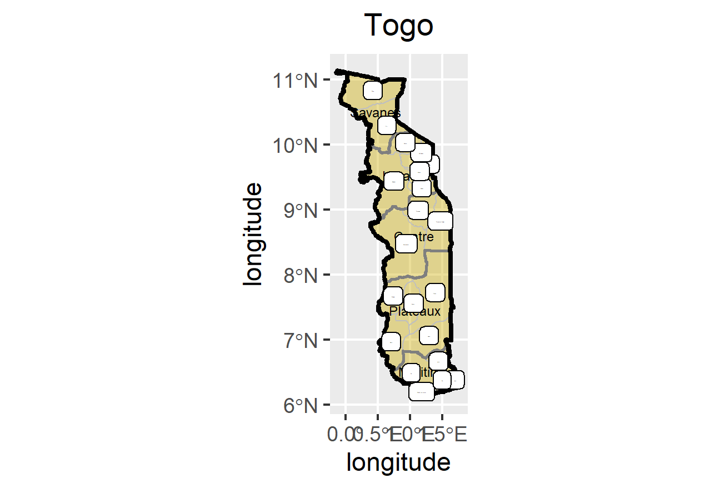

# This my Assignment 1 and the plots produced.

# I created the image by separating the first level of administrative areas and creating larger labels for each area and then doing the same thing for the second level of administrative areas.

# This is my challenge problem for assignment 1.

# I created the image by separating the first level of administrative areas and creating larger labels for each area and then doing the same thing for the second level of administrative areas.

