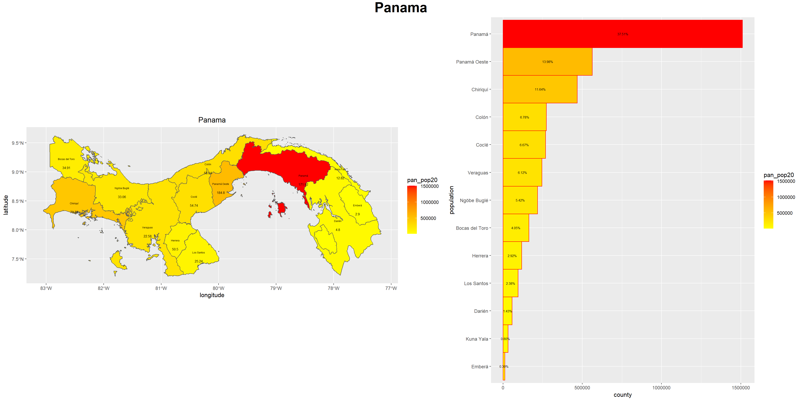
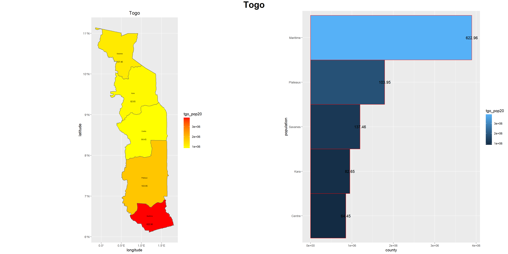

# This is my assignment 2 and the plots produced.
# I used the population density to determine which counties have the largest populations, then made the counties that have a higher population red and the counties with lower populations white.

# This is my second challenge problem and the plot produced.
# I used the population density to determine which counties have the largest populations, then made the counties that have a higher population red and the counties with lower populations white.

